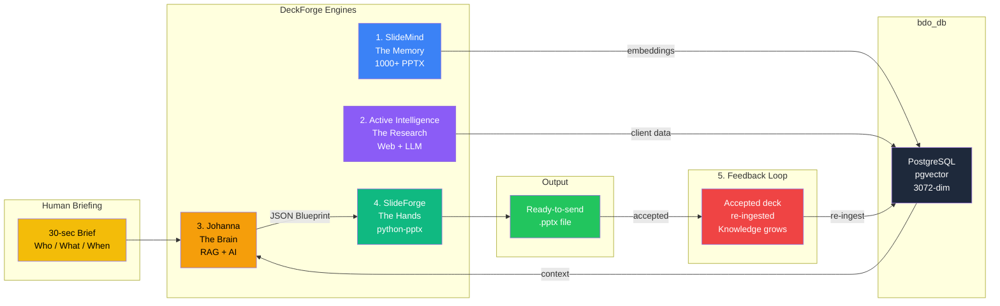
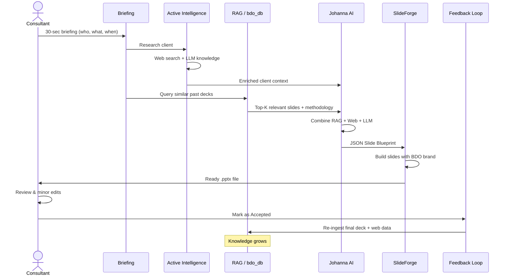

# AI-Native PPTX Generation: The DeckForge Vision

> **No templates. No placeholders. AI writes the deck. You send it.**
> **AI researches the client. AI learns from every accepted proposal.**

*Document Version: 1.1.0 | February 2026 | Part of the Antigravity Intelligence Ecosystem*

---

## 1. Executive Summary

DeckForge eliminates manual presentation creation for recurring business deliverables: **Financial Due Diligence (FDD)**, **Tax Due Diligence (TDD)**, and **Internal Audit (IA)** proposals.

The AI learns from **1000+ historical presentations**, actively researches the client from the web, and generates complete, branded, ready-to-send PPTX files from a **30-second human briefing**.

### Traditional vs. AI-Native

| Traditional (Old School) | AI-Native (DeckForge) |
|---|---|
| Copy an old deck, change client name | AI writes fresh, contextual content |
| Find-and-replace placeholders | AI decides structure, layout, text |
| 2-4 hours of manual editing | 30 seconds of input, ready deck |
| Inconsistent quality | AI applies distilled best practices |
| Knowledge trapped in files | Searchable RAG vector database |
| Consultant Googles alone | AI researches client from web and LLM |
| Accepted decks rot on SharePoint | Accepted decks feed back into AI's brain |

---

## 2. Architecture: The Five Engines

DeckForge is built on five engines that work together in a continuous cycle:



---

### Engine 1: SlideMind — The Memory

**Purpose**: Extract, analyze, and vectorize every slide from every historic presentation.

- Scans thematic folders (`/BDO/FDD/source/`, `/BDO/TDD/source/`)
- Extracts text, styles, comments, and structure from each slide
- Generates AI summaries per slide and per presentation
- Stores everything in PostgreSQL with pgvector embeddings
- Groups knowledge by tenant and theme (`SummarizeTheme`)
- Produces thematic "seed" knowledge (merged best practices)

**Status**: Operational — 22+ PPTX files processed and embedded in bdo_db.

### Engine 2: Active Intelligence — The Research

**Purpose**: Enrich the briefing with real-world information about the client.

- **Web Research**: Searches the internet for the target company (financial reports, news, ownership, regulatory filings, competitors)
- **LLM General Knowledge**: Leverages Gemini's built-in world knowledge about industries, market trends, regulatory frameworks (MNB for banking, AFA rules for tax)
- **Enriched Context**: Combines web findings + LLM knowledge + RAG data into one comprehensive context

**Example**: When briefed about "Acme Corp, logistics company", the AI automatically:
- Finds Acme Corp's annual revenue, employee count, recent acquisitions
- Identifies key regulatory risks for logistics companies in Hungary
- Discovers recent M&A trends in the sector
- Adds all of this to the presentation content (e.g., "Industry Context" slide)

**Status**: To be built (Gemini Search Grounding API + custom scraping).

### Engine 3: Johanna — The Brain

**Purpose**: Understand the briefing, retrieve knowledge, generate structured slide blueprint.

- Receives a natural language briefing (who, what, when)
- Combines three knowledge sources: **RAG** (past decks) + **Web Research** (live data) + **LLM Knowledge** (general expertise)
- Generates a **JSON Slide Blueprint** — structured description of every slide
- Each slide contains: type, title, content, bullets, tables, and layout hints

**Status**: RAG retrieval working (0.72-0.75 similarity scores for FDD queries).

### Engine 4: SlideForge — The Hands

**Purpose**: Take the JSON blueprint and produce a real .pptx file with BDO brand identity.

- Reads the JSON Slide Blueprint from Johanna
- Opens a BDO Master Layout file (brand colors, fonts, logo — no content)
- Creates each slide programmatically using python-pptx
- Picks the right layout for each slide type (cover, bullet, table, team, timeline)
- Exports the final .pptx ready to email

**Status**: To be built.

### Engine 5: Feedback Loop — The Learning Cycle

**Purpose**: Every accepted proposal makes the AI smarter.

When a consultant marks a generated PPTX as "Accepted / Sent to client":

1. **Re-ingests** the final PPTX (including human edits) back into SlideMind
2. **Embeds** new content into bdo_db as fresh vector knowledge
3. **Tags** it with outcome metadata (client, service type, deal size, win/loss)
4. **Enriches Golden Seeds**: Summarizer merges accepted deck's patterns into the thematic seed

The AI's knowledge **grows organically** — every successful proposal teaches it what works. Web-researched client data also gets stored, building a **client intelligence database**.

**The virtuous cycle**:
- Generate deck → Human reviews → Accepted → Re-ingest → Better future decks
- Generate deck → Human edits → Accepted → Re-ingest with corrections → AI learns from fixes
- Generate deck → Rejected → Consultant feedback → AI regenerates with adjustments

**Status**: To be designed.

---

## 3. The Workflow: From Briefing to Deck



### Step 1: Human Briefing (30 seconds)

The consultant provides minimal input:

```yaml
client: "Acme Corporation"
target: "MBH Bank - ATM Division"
service: "FDD + TDD"
industry: "Financial Services / Banking"
timeline: "6 weeks"
team_lead: "Dr. Kovacs Peter"
language: "Hungarian"
special_notes: "Focus on regulatory compliance (MNB)"
```

### Step 2: Active Intelligence — Client Research (Automatic)

Before writing a single word, the AI researches the client:

| Source | What It Finds |
|---|---|
| **Web Search** | Acme Corp website, news, financial reports, ownership |
| **Regulatory Databases** | MNB filings, company registry (e-cegjegyzek.hu) |
| **LLM World Knowledge** | Banking trends, ATM market dynamics, M&A norms |
| **LinkedIn / Public Data** | Key executives, company size, recent changes |

### Step 3: RAG Knowledge Retrieval (Automatic)

Johanna queries bdo_db and retrieves:
- Past FDD proposals for similar industries (banking, financial services)
- Pricing patterns for 6-week engagements
- Standard BDO methodology sections
- Team structure examples for financial services
- Regulatory compliance language from past MBH-related work

### Step 4: AI Content Generation (Automatic)

The AI combines **three knowledge layers** into one contextual output:
1. **Internal RAG** — what BDO has done before (methodology, pricing, team patterns)
2. **Active Intelligence** — what the AI found about Acme Corp and the banking industry
3. **LLM Expertise** — general due diligence best practices, regulatory knowledge

The AI produces a **JSON Slide Blueprint**:

```json
{
  "metadata": {
    "title": "Acme Corporation — Penzugyi es Adoatvilagitas",
    "total_slides": 12,
    "language": "hu"
  },
  "slides": [
    {
      "number": 1,
      "type": "cover",
      "layout": "title_slide",
      "content": {
        "title": "Acme Corporation",
        "subtitle": "Penzugyi es Adoatvilagitas (FDD+TDD)",
        "date": "2026. februar",
        "confidential": true
      }
    },
    {
      "number": 5,
      "type": "methodology",
      "layout": "two_column",
      "content": {
        "title": "Modszertan",
        "left_column": {
          "heading": "Penzugyi Atvilagitas (FDD)",
          "bullets": [
            "Penzugyi kimutatasok elemzese (3 ev)",
            "Normalizalt EBITDA meghatarozasa",
            "Net debt / working capital korrekciok",
            "Red Flag jelentes az elso 2 hetben"
          ]
        },
        "right_column": {
          "heading": "Adoatvilagitas (TDD)",
          "bullets": [
            "AFA es tarsasagi ado megfelelos",
            "Transzferar dokumentacio vizsgalat",
            "Adokockazatok szamszerusitese",
            "MNB szabalyozasi megfelelos"
          ]
        }
      }
    },
    {
      "number": 8,
      "type": "pricing",
      "layout": "table_slide",
      "content": {
        "title": "Dijazas",
        "table": {
          "headers": ["Szolgaltatas", "Oradij (EUR)", "Becsult oraszam", "Osszesen (EUR)"],
          "rows": [
            ["FDD - Partner", "350", "40", "14,000"],
            ["FDD - Manager", "250", "120", "30,000"],
            ["TDD - Tax Partner", "350", "30", "10,500"],
            ["TDD - Senior", "200", "80", "16,000"]
          ],
          "total": "70,500 EUR + AFA"
        }
      }
    }
  ]
}
```

### Step 5: PPTX Assembly (Automatic)

SlideForge reads the blueprint, opens the BDO Master Layout, and builds each slide:

- **Input**: slide_blueprint.json + BDO_Master.pptx (brand only)
- **Output**: Acme_Corporation_FDD_TDD_Ajanlat_2026.pptx (12 slides, ready to send)

### Step 6: Human Review and Feedback Loop

The consultant opens the PPTX, reviews it, makes minor edits if needed, then marks it as "Accepted":

- **Accepted as-is** → The deck is perfect — AI learns to repeat this quality
- **Edited then accepted** → AI learns from human corrections — future decks get smarter
- **Rejected** → Consultant provides feedback, AI regenerates with adjustments

The system re-ingests the final version + web research data into bdo_db — **knowledge grows**.

---

## 4. Technology Stack

| Layer | Technology | Purpose |
|---|---|---|
| Knowledge Store | PostgreSQL + pgvector | Vector similarity search over 1000+ decks |
| Embeddings | Gemini embedding-001 | 3072-dimension vectors for semantic search |
| AI Brain | Gemini 2.5 Flash/Pro | Content generation from RAG context |
| Web Research | Gemini Search Grounding | Real-time internet search for client data |
| LLM Knowledge | Gemini (built-in) | Industry expertise, regulations, best practices |
| PPTX Builder | python-pptx | Programmatic slide creation with full control |
| Brand Source | BDO Master .pptx | Slide layouts, colors, fonts, logo |
| Orchestrator | Go (DeckForge CLI) | Ties everything together in one command |
| Chat Interface | Johanna | Interactive refinement and Q&A |
| Feedback Store | PostgreSQL | Tracks accepted/rejected decks + outcomes |

### Why python-pptx?

- Full programmatic control over every shape, text run, font, color, and position
- Can create tables, charts, images, and complex layouts
- Works directly with .pptx XML structure — no LibreOffice needed
- Mature library, battle-tested for enterprise PPTX generation
- Can read Master Layout slide definitions and apply them automatically

---

## 5. The BDO Master Layout

The Master Layout is **not a template** — it contains **zero content**. It defines only the visual DNA:

| Layout Name | Purpose | Elements |
|---|---|---|
| title_slide | Cover page | BDO logo, title, subtitle, date |
| section_header | Chapter dividers | Large text, accent bar |
| bullet_slide | Standard content | Title + body placeholder |
| two_column | Side-by-side comparison | Title + 2 body areas |
| table_slide | Pricing, timelines, data | Title + table placeholder |
| team_slide | Team introduction | Photo placeholders + titles |
| closing_slide | Contact information | Partner photo, email, phone |

> **Key**: BDO's brand team provides this once. It never changes unless the brand identity changes.

---

## 6. The Four Knowledge Sources

### Source 1: Passive Knowledge (Historical RAG)

| Level | Source | Stored In |
|---|---|---|
| Raw Slides | Individual slide text (10K+) | deckforge.slide_knowledge |
| Embeddings | 3072-dim vectors for similarity | meta.mcp_embeddings |
| Golden Seeds | AI-merged best practices | deckforge.summarized_slides |
| Accepted Decks | Human-approved final versions | Re-ingested into all three above |

### Source 2: Active Knowledge (Real-time Research)

| Source | Example Data |
|---|---|
| Gemini Search Grounding | Client website, financials, news, ownership |
| Company Registry APIs | e-cegjegyzek.hu, opten.hu, EU regulatory DBs |
| LLM World Knowledge | Industry benchmarks, M&A norms, tax regulations |
| Public LinkedIn Data | Key decision-makers, company size, recent hires |

### Source 3: LLM Built-in Knowledge

Gemini's trained knowledge about industries, regulations, best practices, and general business expertise — available without any database query.

### Source 4: Feedback Knowledge (Self-Improving)

| Event | Action |
|---|---|
| PPTX accepted as-is | Full re-ingestion — AI learns this was good |
| PPTX edited then accepted | Diff analysis — AI learns what humans corrected |
| PPTX rejected | Tagged as negative — AI avoids this pattern |
| Client deal won | Weighted higher in future similarity searches |
| Client deal lost | Lower weight — AI adjusts pricing/approach |

**All four sources merge into one AI context → JSON Slide Blueprint → Final PPTX**

---

## 7. Implementation Roadmap

### Phase 1: Foundation (Done)
- [x] PPTX text extraction pipeline (pptx_to_mcp.sh)
- [x] Gemini embedding pipeline (embed_pptx.sh)
- [x] bdo_db with pgvector and tenant partitioning
- [x] RAG retrieval verified (0.72-0.75 similarity)
- [x] 22+ BDO presentations processed

### Phase 2: Deep Knowledge (Next)
- [ ] Run slidemind scan on all 1000+ PPTX files
- [ ] Run slidemind summarize --tenant BDO --theme FDD (Golden Seeds)
- [ ] Run slidemind summarize --tenant BDO --theme TDD
- [ ] Verify knowledge granularity (slide-level vs. presentation-level)

### Phase 3: Active Intelligence
- [ ] Integrate Gemini Search Grounding API for web research
- [ ] Build client research module (company registry, news, financials)
- [ ] Create enrichment pipeline: briefing → web research → enriched context
- [ ] Store researched data alongside RAG context for future reuse

### Phase 4: AI Blueprint Generator
- [ ] Create FDD Generator MCP for Johanna (JSON Slide Blueprint schema)
- [ ] Train the prompt to combine RAG + Web + LLM knowledge sources
- [ ] Test blueprint generation: briefing → research → JSON → validate
- [ ] Add multi-language support (HU/EN)

### Phase 5: PPTX Builder Engine
- [ ] Obtain/create BDO Master Layout .pptx
- [ ] Build python-pptx builder script (scripts/forge_pptx.py)
- [ ] Map JSON slide types → Master Layout slide layouts
- [ ] Handle tables, bullets, two-column, images
- [ ] Add cover slide with dynamic date and confidentiality notice

### Phase 6: One-Command Pipeline
- [ ] Create deckforge forge CLI command
- [ ] Input: YAML/JSON briefing or interactive prompts
- [ ] Output: Finished .pptx in output/ directory
- [ ] Optional: Johanna chat-based interactive refinement
- [ ] Optional: PDF export alongside PPTX

### Phase 7: Feedback Loop and Self-Improvement
- [ ] Build "Accept / Reject" UI in DeckForge
- [ ] On accept: auto re-ingest final PPTX + web research data
- [ ] On reject with edits: diff analysis to learn from corrections
- [ ] Track deal outcomes (won/lost) to weight knowledge quality
- [ ] Quality scoring: AI rates its own output against accepted proposals

### Phase 8: Scale
- [ ] Process remaining 1000+ PPTX files
- [ ] Add TDD, IA, and Valuation service types
- [ ] Multi-tenant support (BDO Hungary, BDO Global)
- [ ] Client intelligence database (accumulated web research)

---

## 8. CLI Interface

### Quick Generation
```bash
# Generate from a briefing file
deckforge forge --tenant BDO --theme FDD --brief briefing.yaml

# Interactive mode (AI asks the questions)
deckforge forge --tenant BDO --theme FDD --interactive

# Generate blueprint only (for review before building PPTX)
deckforge forge --tenant BDO --theme FDD --brief briefing.yaml --blueprint-only
```

### Johanna Chat Mode
```
User:    "Keszits egy FDD ajanlatot az Acme Corp reszere, logisztikai iparag, 6 hetes projekt"
Johanna: [Retrieves RAG] → [Web Research] → [JSON Blueprint] → [SlideForge] →
         "Az ajanlat elkeszult: Acme_Corp_FDD_Ajanlat_2026.pptx (12 slide, magyar)"
```

---

## 9. Success Criteria

| Metric | Target |
|---|---|
| Time to generate proposal | Less than 2 minutes (including AI processing) |
| Human input required | Less than 1 minute (who, what, when) |
| Content accuracy | 90%+ match with senior partner standards |
| Brand compliance | 100% (Master Layout enforces brand) |
| Supported service types | FDD, TDD, IA, Valuation |
| Languages | Hungarian, English |
| Knowledge growth | Every accepted deck improves future output |
| Client research depth | Automated background from web + LLM |

---

*Built with the Antigravity Intelligence Ecosystem*
*DeckForge x Johanna x SlideMind x SlideForge*
