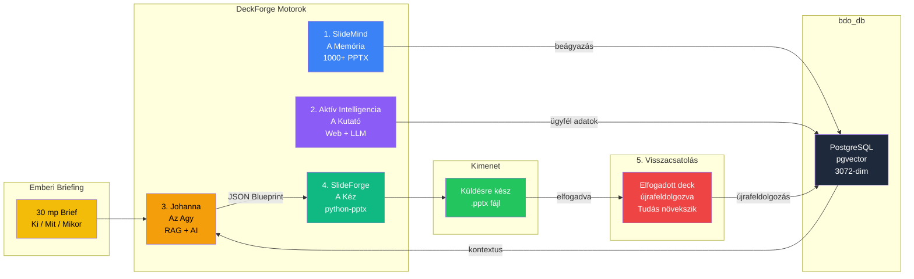
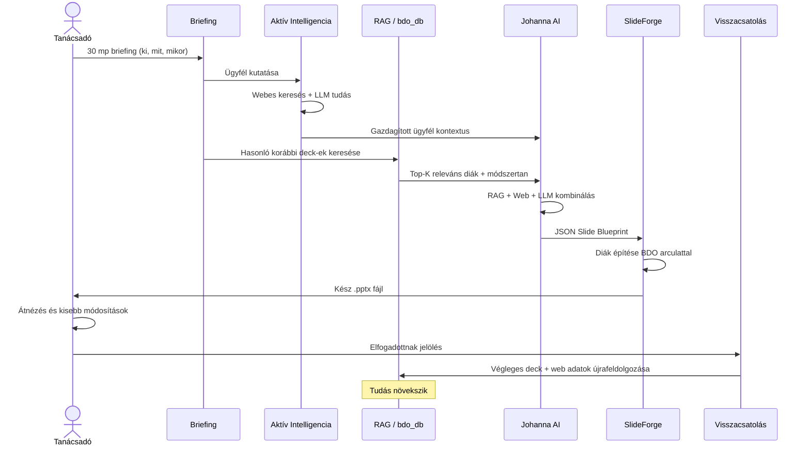

# AI-Natív PPTX Generálás: A DeckForge Vízió

> **Nincs sablon. Nincs placeholder. Az AI írja a prezentációt. Te elküldöd.**
> **Az AI kutatja a megrendelőt. Az AI tanul minden elfogadott ajánlatból.**

*Dokumentum verzió: 1.1.0 | 2026. február | Az Antigravity Intelligence Ökoszisztéma része*

---

## 1. Vezetői Összefoglaló

A DeckForge célja a manuális prezentáció-készítés kiváltása visszatérő üzleti dokumentumoknál: **Pénzügyi Átvilágítás (FDD)**, **Adóátvilágítás (TDD)** és **Belső Audit (IA)** ajánlatoknál.

Az AI **1000+ korábbi prezentációból** tanul, aktívan kutatja a megrendelőt az internetről, és komplett, márkázott, küldésre kész PPTX fájlokat generál egy **30 másodperces emberi briefingből**.

### Hagyományos vs. AI-Natív megközelítés

| Hagyományos (régi módszer) | AI-Natív (DeckForge) |
|---|---|
| Régi deck másolása, ügyfélnév cseréje | Az AI friss, kontextuális tartalmat ír |
| Placeholder-ek keresése és cseréje | Az AI dönt a struktúráról, elrendezésről, szövegről |
| 2-4 óra kézi szerkesztés | 30 másodperc input, kész prezentáció |
| Ingadozó minőség | Az AI desztillált legjobb gyakorlatokat alkalmaz |
| Tudás egyedi fájlokba ragadva | Kereshető RAG vektor-adatbázis |
| A tanácsadó egyedül Google-özik | Az AI kutatja az ügyfelet webről és LLM-ből |
| Elfogadott deck-ek a SharePoint-on rohadnak | Az elfogadott deck-ek visszatáplálják az AI agyát |

---

## 2. Architektúra: Az Öt Motor

A DeckForge öt motorból áll, amelyek folyamatos ciklusban működnek együtt:



---

### Motor 1: SlideMind — A Memória

**Cél**: Minden korábbi prezentáció minden diájának kinyerése, elemzése és vektorizálása.

- Tematikus mappák szkennelése (`/BDO/FDD/source/`, `/BDO/TDD/source/`)
- Szöveg, stílusok, megjegyzések és struktúra kinyerése minden diából
- AI összefoglalók generálása diánként és prezentációnként
- Minden adat tárolása PostgreSQL-ben pgvector embedding-ekkel
- Tudás csoportosítása bérlő és téma szerint (`SummarizeTheme`)
- Tematikus "seed" tudás előállítása (egyesített legjobb gyakorlatok)

**Állapot**: Működőképes — 22+ PPTX fájl feldolgozva és beágyazva a bdo_db-be.

### Motor 2: Aktív Intelligencia — A Kutató

**Cél**: A briefing gazdagítása valós információkkal az ügyfélről.

- **Webes kutatás**: Az interneten keresi a célvállalatot (pénzügyi jelentések, hírek, tulajdonosi struktúra, hatósági nyilvántartások, versenytársak)
- **LLM Általános Tudás**: A Gemini beépített világtudásának felhasználása iparágakról, piaci trendekről, szabályozási keretrendszerekről (MNB bankszektornál, ÁFA szabályok adónál)
- **Gazdagított Kontextus**: Webes eredmények + LLM tudás + RAG adatok egyesítése egyetlen átfogó kontextusba

**Példa**: Amikor a briefing "Acme Corp, logisztikai cég"-ről szól, az AI automatikusan:
- Megtalálja az Acme Corp éves bevételét, alkalmazotti létszámát, legutóbbi felvásárlásait
- Azonosítja a logisztikai cégek fő szabályozási kockázatait Magyarországon
- Feltárja az aktuális M&A trendeket a szektorban
- Mindezt beépíti a prezentáció tartalmába (pl. "Iparági Kontextus" dia)

**Állapot**: Fejlesztés alatt (Gemini Search Grounding API + egyedi scraping).

### Motor 3: Johanna — Az Agy

**Cél**: A briefing megértése, tudás visszakeresése, strukturált dia blueprint generálása.

- Természetes nyelvű briefing fogadása (ki, mit, mikor)
- Három tudásforrás kombinálása: **RAG** (korábbi deck-ek) + **Webes Kutatás** (élő adatok) + **LLM Tudás** (általános szakértelem)
- **JSON Slide Blueprint** generálása — minden dia strukturált leírása
- Minden dia tartalmazza: típust, címet, tartalmat, felsoroláspontokat, táblázatokat, elrendezési utasításokat

**Állapot**: RAG visszakeresés működik (0.72-0.75 hasonlósági pontszám FDD lekérdezéseknél).

### Motor 4: SlideForge — A Kéz

**Cél**: A JSON blueprint alapján valódi .pptx fájl előállítása BDO arculattal.

- JSON Slide Blueprint beolvasása Johanna-tól
- BDO Master Layout fájl megnyitása (márkaszínek, betűtípusok, logó — tartalom nélkül)
- Minden dia programozott létrehozása python-pptx használatával
- A megfelelő elrendezés kiválasztása minden dia-típushoz (borító, felsorolás, táblázat, csapat, ütemterv)
- Végleges .pptx exportálása, e-mailre készen

**Állapot**: Fejlesztés alatt.

### Motor 5: Visszacsatolási Hurok — A Tanulási Ciklus

**Cél**: Minden elfogadott ajánlat okosabbá teszi az AI-t.

Amikor egy tanácsadó "Elfogadott / Elküldve az ügyfélnek" jelöléssel lát el egy generált PPTX-et:

1. **Újrafeldolgozza** a végleges PPTX-et (beleértve az emberi módosításokat) a SlideMind-ba
2. **Beágyazza** az új tartalmat a bdo_db-be friss vektor-tudásként
3. **Címkézi** kimenet-metaadatokkal (ügyfél, szolgáltatás típusa, üzlet mérete, nyert/vesztett)
4. **Gazdagítja a Golden Seed-eket**: Az összefoglaló egyesíti az elfogadott deck mintáit a tematikus seed-be

Az AI tudása **organikusan növekszik** — minden sikeres ajánlat megtanítja, mi működik. A webes kutatás adatai is tárolódnak, felépítve egy **ügyfél-intelligencia adatbázist**.

**Az erényes kör**:
- Deck generálás → Emberi átnézés → Elfogadva → Újrafeldolgozás → Jobb jövőbeli deck-ek
- Deck generálás → Emberi szerkesztés → Elfogadva → Javításokkal újrafeldolgozás → AI tanul a módosításokból
- Deck generálás → Elutasítva → Tanácsadói visszajelzés → AI újragenerál a módosításokkal

**Állapot**: Tervezés alatt.

---

## 3. A Munkafolyamat: Briefingtől a Deck-ig



### 1. lépés: Emberi Briefing (30 másodperc)

A tanácsadó minimális inputot ad:

```yaml
ugyfel: "Acme Corporation"
celvalallat: "MBH Bank - ATM Divízió"
szolgaltatas: "FDD + TDD"
iparag: "Pénzügyi szolgáltatások / Bankszolgáltatások"
idokeret: "6 hét"
csapatvezeto: "Dr. Kovács Péter"
nyelv: "Magyar"
megjegyzes: "Fókusz a szabályozási megfelelőségre (MNB)"
```

### 2. lépés: Aktív Intelligencia — Ügyfélkutatás (Automatikus)

Az AI az első szó leírása előtt **kutatja az ügyfelet**:

| Forrás | Mit talál |
|---|---|
| **Webes keresés** | Acme Corp weboldala, hírek, pénzügyi jelentések, tulajdonosi struktúra |
| **Hatósági nyilvántartások** | MNB adatok, cégnyilvántartás (e-cegjegyzek.hu) |
| **LLM Világtudás** | Bankszektor trendek, ATM piaci dinamika, M&A normák |
| **LinkedIn / Nyilvános adatok** | Kulcs döntéshozók, cégméret, legutóbbi változások |

### 3. lépés: RAG Tudásvisszakeresés (Automatikus)

Johanna lekérdezi a bdo_db-t és visszakeresi:
- Korábbi FDD ajánlatok hasonló iparágakra (bankszektor, pénzügyi szolgáltatások)
- Árazási minták 6 hetes megbízásokhoz
- Standard BDO módszertani szekciók
- Csapatstruktúra példák pénzügyi szolgáltatásokhoz
- Szabályozási megfelelőségi nyelvezet korábbi MBH-kapcsolódó munkákból

### 4. lépés: AI Tartalom-generálás (Automatikus)

Az AI **három tudásréteget** kombinál egyetlen kontextuális kimenetbe:
1. **Belső RAG** — amit a BDO korábban csinált (módszertan, árazás, csapatminták)
2. **Aktív Intelligencia** — amit az AI az Acme Corp-ról és a bankszektorról talált
3. **LLM Szakértelem** — általános átvilágítási legjobb gyakorlatok, szabályozási tudás

Az AI egy **JSON Slide Blueprint**-et állít elő a prezentáció minden diájának strukturált leírásával.

### 5. lépés: PPTX Összeállítás (Automatikus)

A SlideForge beolvassa a blueprint-et, megnyitja a BDO Master Layout-ot, és felépíti minden diát:

- **Bemenet**: slide_blueprint.json + BDO_Master.pptx (csak arculat)
- **Kimenet**: Acme_Corporation_FDD_TDD_Ajanlat_2026.pptx (12 dia, küldésre kész)

### 6. lépés: Emberi Átnézés és Visszacsatolás

A tanácsadó megnyitja a PPTX-et, átnézi, szükség esetén kisebb módosításokat végez, majd "Elfogadott" jelöléssel látja el:

- **Változtatás nélkül elfogadva** → A deck tökéletes — az AI megtanulja ezt a minőséget ismételni
- **Szerkesztés után elfogadva** → Az AI tanul az emberi javításokból — a jövőbeli deck-ek jobbak lesznek
- **Elutasítva** → A tanácsadó visszajelzést ad, az AI újragenerál a módosításokkal

A rendszer újrafeldolgozza a végleges verziót + webes kutatási adatokat a bdo_db-be — **a tudás növekszik**.

---

## 4. Technológiai Stack

| Réteg | Technológia | Cél |
|---|---|---|
| Tudástár | PostgreSQL + pgvector | Vektor hasonlósági keresés 1000+ deck felett |
| Beágyazások | Gemini embedding-001 | 3072-dimenziós vektorok szemantikus kereséshez |
| AI Agy | Gemini 2.5 Flash/Pro | Tartalom-generálás RAG kontextusból |
| Webes Kutatás | Gemini Search Grounding | Valós idejű internetes keresés ügyféladatokért |
| LLM Tudás | Gemini (beépített) | Iparági szakértelem, szabályozás, legjobb gyakorlatok |
| PPTX Építő | python-pptx | Programozott dia-létrehozás teljes kontrollal |
| Arculati Forrás | BDO Master .pptx | Dia-elrendezések, színek, betűtípusok, logó |
| Vezérlő | Go (DeckForge CLI) | Mindent egyetlen parancsba köt össze |
| Chat Felület | Johanna | Interaktív finomítás és kérdések |
| Visszacsatolás Tár | PostgreSQL | Elfogadott/elutasított deck-ek + kimenetek nyomon követése |

---

## 5. A Négy Tudásforrás

### Forrás 1: Passzív Tudás (Történeti RAG)

| Szint | Forrás | Tárolás |
|---|---|---|
| Nyers Diák | Egyedi dia szövege (10K+) | deckforge.slide_knowledge |
| Beágyazások | 3072-dim vektorok hasonlósághoz | meta.mcp_embeddings |
| Golden Seed-ek | AI által egyesített legjobb gyakorlatok | deckforge.summarized_slides |
| Elfogadott Deck-ek | Emberileg jóváhagyott végleges verziók | Visszafeldolgozva mindháromba |

### Forrás 2: Aktív Tudás (Valós idejű Kutatás)

| Forrás | Példa Adatok |
|---|---|
| Gemini Search Grounding | Ügyfél weboldala, pénzügyek, hírek, tulajdonosi szerkezet |
| Cégnyilvántartás API-k | e-cegjegyzek.hu, opten.hu, EU hatósági adatbázisok |
| LLM Világtudás | Iparági benchmarkok, M&A normák, adószabályozás |
| Nyilvános LinkedIn Adatok | Kulcs döntéshozók, cégméret, legutóbbi felvételek |

### Forrás 3: LLM Beépített Tudás

A Gemini betanított tudása iparágakról, szabályozásokról, legjobb gyakorlatokról és általános üzleti szakértelemről — elérhető bármiféle adatbázis-lekérdezés nélkül.

### Forrás 4: Visszacsatolási Tudás (Önfejlesztő)

| Esemény | Művelet |
|---|---|
| PPTX változtatás nélkül elfogadva | Teljes újrafeldolgozás — AI megtanulja, hogy ez jó volt |
| PPTX szerkesztés után elfogadva | Diff elemzés — AI megtanulja, mit javított az ember |
| PPTX elutasítva | Negatív példaként címkézve — AI kerüli ezt a mintát |
| Ügyfélnél megnyert deal | Magasabb súly a jövőbeli hasonlósági kereséseknél |
| Ügyfélnél elvesztett deal | Alacsonyabb súly — AI módosítja az árazást/megközelítést |

**Mind a négy forrás egyetlen AI kontextusba olvad → JSON Slide Blueprint → Végleges PPTX**

---

## 6. Megvalósítási Ütemterv

### 1. Fázis: Alapozás (Kész)
- [x] PPTX szöveg kinyerési pipeline (pptx_to_mcp.sh)
- [x] Gemini beágyazási pipeline (embed_pptx.sh)
- [x] bdo_db pgvector-ral és bérlői particionálással
- [x] RAG visszakeresés ellenőrizve (0.72-0.75 hasonlóság)
- [x] 22+ BDO prezentáció feldolgozva

### 2. Fázis: Mély Tudás (Következő)
- [ ] slidemind scan futtatása mind az 1000+ PPTX fájlon
- [ ] slidemind summarize --tenant BDO --theme FDD (Golden Seed-ek)
- [ ] slidemind summarize --tenant BDO --theme TDD
- [ ] Tudás-granularitás ellenőrzése (dia-szintű vs. prezentáció-szintű)

### 3. Fázis: Aktív Intelligencia
- [ ] Gemini Search Grounding API integrálása webes kutatáshoz
- [ ] Ügyfélkutatási modul építése (cégnyilvántartás, hírek, pénzügyek)
- [ ] Gazdagítási pipeline létrehozása: briefing → webes kutatás → gazdagított kontextus
- [ ] Kutatott adatok tárolása a RAG kontextus mellett jövőbeli felhasználásra

### 4. Fázis: AI Blueprint Generátor
- [ ] FDD Generátor MCP létrehozása Johanna-nak (JSON Slide Blueprint séma)
- [ ] Prompt tanítása RAG + Web + LLM tudásforrások kombinálására
- [ ] Blueprint generálás tesztelése: briefing → kutatás → JSON → validálás
- [ ] Többnyelvű támogatás hozzáadása (HU/EN)

### 5. Fázis: PPTX Építő Motor
- [ ] BDO Master Layout .pptx beszerzése/létrehozása
- [ ] python-pptx építő script fejlesztése (scripts/forge_pptx.py)
- [ ] JSON dia-típusok → Master Layout dia-elrendezések leképezése
- [ ] Táblázatok, felsorolások, kétoszlopos, képek kezelése
- [ ] Borító dia dinamikus dátummal és bizalmassági megjegyzéssel

### 6. Fázis: Egyparancs-Pipeline
- [ ] deckforge forge CLI parancs létrehozása
- [ ] Bemenet: YAML/JSON briefing vagy interaktív kérdések
- [ ] Kimenet: Kész .pptx az output/ könyvtárban
- [ ] Opcionális: Johanna chat-alapú interaktív finomítás
- [ ] Opcionális: PDF exportálás a PPTX mellett

### 7. Fázis: Visszacsatolási Hurok és Önfejlesztés
- [ ] "Elfogadás / Elutasítás" UI építése a DeckForge-ban
- [ ] Elfogadásnál: végleges PPTX + webes kutatási adatok automatikus újrafeldolgozása
- [ ] Elutasítás szerkesztéssel: diff elemzés a javítások tanulásához
- [ ] Deal kimenetek nyomon követése (nyert/vesztett) a tudásminőség súlyozásához
- [ ] Minőségi pontozás: AI értékeli saját kimenetét az elfogadott ajánlatokhoz képest

### 8. Fázis: Skálázás
- [ ] Fennmaradó 1000+ PPTX fájl feldolgozása
- [ ] TDD, IA és Értékelési szolgáltatás-típusok hozzáadása
- [ ] Több-bérlős támogatás (BDO Magyarország, BDO Global)
- [ ] Ügyfél-intelligencia adatbázis (felhalmozott webes kutatás)

---

## 7. Sikerkritériumok

| Metrika | Célérték |
|---|---|
| Ajánlat generálási idő | Kevesebb mint 2 perc (AI feldolgozást beleértve) |
| Szükséges emberi input | Kevesebb mint 1 perc (ki, mit, mikor) |
| Tartalmi pontosság | 90%+ egyezés senior partner standardokkal |
| Arculati megfelelőség | 100% (Master Layout biztosítja az arculatot) |
| Támogatott szolgáltatás-típusok | FDD, TDD, IA, Értékelés |
| Nyelvek | Magyar, Angol |
| Tudásnövekedés | Minden elfogadott deck javítja a jövőbeli kimenetet |
| Ügyfélkutatás mélysége | Automatizált háttér webről + LLM-ből |

---

*Az Antigravity Intelligence Ökoszisztémával épült*
*DeckForge x Johanna x SlideMind x SlideForge*
